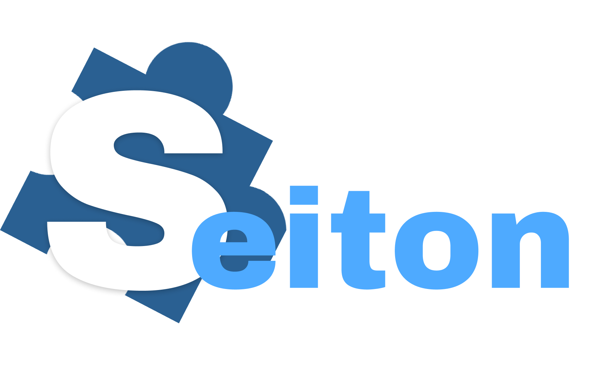

# Seiton

`Tecnologia em Análise e Desenvolvimento de Sistemas`

`Desenvolvimento de uma aplicação interativa`

`Segundo semestre 2023/02`

O projeto em questão tem como objetivo desenvolver um quadro Kanban, projetado para atender às necessidades diversas de equipes de diferentes setores. A proposta envolve a criação de uma plataforma digital que permita a visualização, rastreamento e gerenciamento eficaz de tarefas e fluxos de trabalho, buscando capacitar as equipes a alcançar maior eficiência e melhorar a comunicação, contribuindo para um gerenciamento mais eficaz e uma entrega de projetos bem-sucedida.

## Integrantes

* Bruno Henrique Arantes Dias
* Gustavo da Silva Candido
* Marcos Teixeira Dias
* Pedro Ferreira Andrade
* Renan Gonçalves Cunha
* Wesley Correa Gomes

## Orientador

* Luciana de Nardin

## Instruções de utilização

Acesse o link: [Projeto Seiton](https://projetoseiton.azurewebsites.net)

# Documentação

<ol>
<li><a href="docs/01-Documentação de Contexto.md"> Documentação de Contexto</a></li>
<li><a href="docs/02-Especificação do Projeto.md"> Especificação do Projeto</a></li>
<li><a href="docs/03-Metodologia.md"> Metodologia</a></li>
<li><a href="docs/04-Projeto de Interface.md"> Projeto de Interface</a></li>
<li><a href="docs/05-Arquitetura da Solução.md"> Arquitetura da Solução</a></li>
<li><a href="docs/06-Template Padrão da Aplicação.md"> Template Padrão da Aplicação</a></li>
<li><a href="docs/07-Programação de Funcionalidades.md"> Programação de Funcionalidades</a></li>
<li><a href="docs/08-Plano de Testes de Software.md"> Plano de Testes de Software</a></li>
<li><a href="docs/09-Registro de Testes de Software.md"> Registro de Testes de Software</a></li>
<li><a href="docs/10-Plano de Testes de Usabilidade.md"> Plano de Testes de Usabilidade</a></li>
<li><a href="docs/11-Registro de Testes de Usabilidade.md"> Registro de Testes de Usabilidade</a></li>
<li><a href="docs/12-Apresentação do Projeto.md"> Apresentação do Projeto</a></li>
<li><a href="docs/13-Referências.md"> Referências</a></li>
</ol>

# Código

<li><a href="src/README.md"> Código Fonte</a></li>

# Apresentação

<li><a href="presentation/README.md"> Apresentação da solução</a></li>
