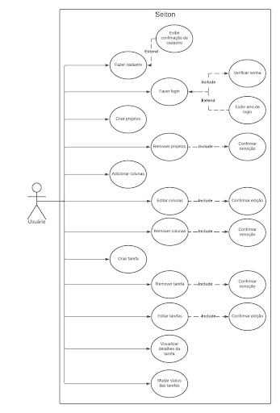

# Especificações do Projeto

A definição exata do problema e os pontos mais relevantes a serem tratados neste projeto foi consolidada com a participação dos usuários em um trabalho de imersão feito pelos membros da equipe a partir da observação dos usuários em seu local natural e por meio de entrevistas.

Os detalhes levantados nesse processo foram consolidados na forma de personas e histórias de usuários.

## Personas

As personas levantadas durante o processo de entendimento do problema são apresentadas a seguir:

|  | DAVID DIEGO | 
|-----------|------------| 
| **Idade:** | 33 anos |
| **Ocupação:** | FreeLancer |
| **Motivações:** | Deseja se tornar um profissional eficiente e multitarefas |
| **Frustrações:** | Se sente sobrecarregado e incapaz de equilibrar prazos e tarefas de diferentes projetos |
| **Aplicativos:** | *Instagram   *Facebook   *LinkedIn |
| **Como o sistema pode facilitar o trabalho?** | Proporcionando a capacidade de criar e organizar listas de tarefas separadas por projetos |

|  | ANDRÉ DORIZOTO | 
|-----------|------------| 
| **Idade:** | 45 anos |
| **Ocupação:** | Empreendedor |
| **Motivações:** | Quer ser um gestor proativo e organizado em seu negócio |
| **Frustrações:** | Não consegue visualizar de maneira clara os vários aspectos de seu negócio, sendo incapaz de lidar com prioridades em constante mudança e manter equipe alinhada |
| **Aplicativos:** | *Instagram   *Facebook   *Zoom |
| **Como o sistema pode facilitar o trabalho?** | Permitir criar quadros personalizados para diferentes áreas do negócio |

|  | SOFIA SANTOS | 
|-----------|------------| 
| **Idade:** | 54 anos |
| **Ocupação:** | Gerente de Recursos Humanos |
| **Motivações:** | Quer se tornar uma gerente mais eficiênte, que possa estar ciente de todos os procedimentos da área e facilitar a colaboração entre os membros de sua equipe |
| **Frustrações:** | Não recebe a situação dos procedimentos do setor com clareza e sua equipe se encontra em uma situação de comunicação desorganizada |
| **Aplicativos:** | *Instagram   *Facebook   LinkedIn   Vagas |
| **Como o sistema pode facilitar o trabalho?** | Permitir criar quadros e tarefas personalizadas |

| | BIANCA AKANA | 
|-----------|------------| 
| **Idade:** | 35 anos |
| **Ocupação:** | Arquiteta |
| **Motivações:** | Tornar seus projetos arquitetonicos mais organizados e claros |
| **Frustrações:** | Se sente pouco produtiva devido aos processos de seus projetos estarem desorganizados |
| **Aplicativos:** | *Instagram   *Facebook   *Microsoft Teams   *AutoCad |
| **Como o sistema pode facilitar o trabalho?** | Permitir organizar as tarefas em colunas |

|  | LUÍS PAULO MARTINS | 
|-----------|------------| 
| **Idade:** | 16 anos |
| **Ocupação:** | Estudante |
| **Motivações:** | Ser um estudante mais proativo |
| **Frustrações:** | Ser desorganizado e consequentemente ruim nos estudos |
| **Aplicativos:** | *Instagram   *Facebook   *Whatsapp   *LinkedIn|
| **Como o sistema pode facilitar o trabalho?** | Permitir o controle de tempo e organização das tarefas acadêmicas |

## Histórias de Usuários

Com base na compreensão do dia-a-dia das funções identificadas para o projeto, as histórias de usuário estão documentadas a seguir:

|EU COMO... `PERSONA`| QUERO/PRECISO ... `FUNCIONALIDADE` |PARA ... `MOTIVO/VALOR`                 |
|--------------------|------------------------------------|----------------------------------------|
| DAVID DIEGO |  |  |
| DAVID DIEGO |  |  |
| ANDRÉ DORIZOTO |  |  |
| ANDRÉ DORIZOTO |  |  |
| SOFIA SANTOS |  |  |
| SOFIA SANTOS |  |  |
| BIANCA AKANA |  |  |
| BIANCA AKANA |  |  |
| LUÍS PAULO MARTINS |  |  |
| LUÍS PAULO MARTINS |  |  |

## Requisitos

O escopo funcional do projeto é definido por meio dos requisitos funcionais que descrevem as possibilidades interação dos usuários, bem como os requisitos não funcionais descrevem os aspectos que o sistema deverá apresentar de maneira geral. Estes requisitos são apresentados a seguir.
 
### Requisitos Funcionais

A tabela a seguir apresenta os requisitos do projeto, identificando a prioridade em que os mesmos devem ser entregues: 

|ID    | Descrição do Requisito  | Prioridade |
|------|-----------------------------------------|----|
|RF-01| O site deverá conter um sistema de cadastro e login do usuário | ALTA | 
|RF-02| Os usuários devem poder criar novas tarefas no quadro Kanban, especificando informações como título, descrição e prazo | ALTA |
|RF-03| Os usuários devem poder remover tarefas que já foram finalizadas ou que ainda estejam em algum estágio fluxo se assim desejarem | ALTA |
|RF-04| O quadro deve permitir a criação de colunas personalizadas que representam diferentes estágios do fluxo de trabalho. Os usuários devem poder adicionar, renomear ou remover colunas conforme necessário | ALTA |
|RF-05| As tarefas devem ser movidas entre as colunas para refletir o progresso do trabalho. Os usuários devem poder arrastar e soltar as tarefas de uma coluna para outra | ALTA |
|RF-06| As tarefas devem conter uma indicação de prioridade que poderá ser alterada pelo usuário dentro de cada coluna para indicar a ordem em que devem ser concluídas | ALTA |
|RF-07| O sistema deverá permitir aos usuários que vejam os detalhes da tarefa para ter acesso a descrição completa e as demais informações inseridas na tarefa | ALTA |
|RF-08| As tarefas deverão ter campo de título, descrição, cor referente a prioridade e nome da pessoa a quem a mesma foi atribuída | ALTA |

### Requisitos não Funcionais

|ID     | Descrição do Requisito  |Prioridade |
|-------|-------------------------|----|
|RNF-01| O site deve ser compatível com os principais navegadores do mercado (Google Chrome, Firefox, Microsoft Edge) | ALTA | 
|RNF-02| O site deverá ser responsivo nas resoluções 1920 x 1080 e 1366 x 768 | ALTA |
|RNF-03| Resposta rápida ao interagir com as tarefas, como arrastar e soltar | ALTA |
|RNF-04| Capacidade de lidar com múltiplos usuários simultaneamente sem degradação significativa no desempenho | ALTA |
|RNF-05| Interface intuitiva e amigável, mesmo para usuários não técnicos | ALTA |
|RNF-06| Navegação clara e lógica, facilitando o acesso às informações e a movimentação das tarefas | ALTA |
|RNF-07| O site deve ter bom nível de contraste entre os elementos da tela em conformidade | MÉDIA |

## Restrições

O projeto está restrito pelos itens apresentados na tabela a seguir.

|ID| Restrição                                             |
|--|-------------------------------------------------------|
|01| O projeto deverá ser entregue no final do semestre letivo |
|02| O sistema não deverá ser terceirizado |

## Diagrama de Casos de Uso

O diagrama de casos de uso é uma representação visual crucial na modelagem de sistemas, destacando as interações entre usuários e as funcionalidades do sistema. Ele esclarece requisitos e promove a comunicação eficaz entre stakeholders, contribuindo para a compreensão geral do projeto. Sendo assim, temos o diagrama referente à este projeto apresentado a seguir:

