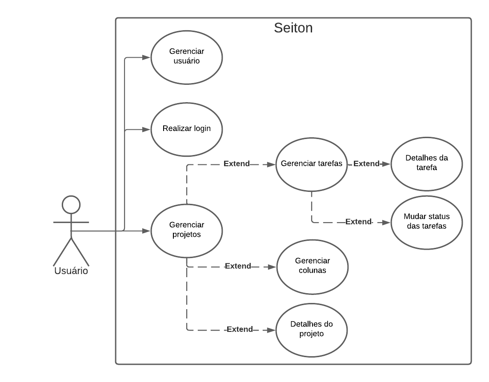

# Especificações do Projeto

A definição exata do problema e os pontos mais relevantes a serem tratados neste projeto foi consolidada com a participação dos usuários em um trabalho de imersão feito pelos membros da equipe a partir da observação dos usuários em seu local natural e por meio de entrevistas.

Os detalhes levantados nesse processo foram consolidados na forma de personas e histórias de usuários.

## Personas

As personas levantadas durante o processo de entendimento do problema são apresentadas a seguir:

|  | DAVID DIEGO | 
|-----------|------------| 
| **Idade:** | 33 anos |
| **Ocupação:** | FreeLancer |
| **Motivações:** | Ser capaz de gerenciar vários projetos simultaneamente, entregar trabalhos de qualidade, estabelecer prazos realistas|
| **Frustrações:** | Tem dificuldade em manter o controle de diferentes projetos, falta de visibilidade sobre o fluxo de trabalho, prazos apertados |
| **Aplicativos:** | *Instagram   *Facebook   *LinkedIn |
| **Como o sistema pode facilitar o trabalho?** | permitir o acompanhamento claro dos projetos, visualização de prazos e gestão mais eficaz do tempo |

|  | ANDRÉ DORIZOTO | 
|-----------|------------| 
| **Idade:** | 45 anos |
| **Ocupação:** | Desenvolvedor |
| **Motivações:** | Ser capaz de contribuir para o sucesso dos projetos da empresa, receber feedback construtivo e cuidar de sua carreira |
| **Frustrações:** | Falta de clareza nas tarefas, dificuldade em acompanhar prioridades, falta de uma boa orientação para seus colegas de equipe |
| **Aplicativos:** | *Instagram   *Facebook   *Zoom   *Visual Studio Code |
| **Como o sistema pode facilitar o trabalho?** | Fornecer tarefas claras e bem definidas, priorização visível e receber feedback direto das atividades |

|  | SOFIA SANTOS | 
|-----------|------------| 
| **Idade:** | 54 anos |
| **Ocupação:** | Gerente de Recursos Humanos |
| **Motivações:** | Poder agilizar o processo de recrutamento, acompanhar o desenvolvimento dos funcionários, garantir conformidade com treinamentos obrigatórios |
| **Frustrações:** | Dificuldade em coordenar várias etapas do recrutamento, falta de clareza sobre a comunicação e progressão dos funcionários |
| **Aplicativos:** | *Instagram   *Facebook   LinkedIn   Vagas |
| **Como o sistema pode facilitar o trabalho?** | Permitir criar quadros e tarefas personalizadas para monitorar o progresso dos funcionários em treinamentos |

| | BIANCA AKANA | 
|-----------|------------| 
| **Idade:** | 35 anos |
| **Ocupação:** | Arquiteta |
| **Motivações:** |  Ter colaboração eficiente com sua equipe, otimizar seus projetos, manter prazos e entregar resultados de alta qualidade aos clientes |
| **Frustrações:** | Sobrecarregamento por múltiplos projetos simultâneos, comunicação caotica entre os membros da equipe e falta de um acompanhamento claro do progresso dos projetos |
| **Aplicativos:** | *Instagram   *Facebook   *Microsoft Teams   *AutoCad |
| **Como o sistema pode facilitar o trabalho?** | Permitir que ela crie quadros separados para cada projeto, uma atribuição clara de tarefas a membros da equipe e adicionar prazos |

|  | LUÍS PAULO MARTINS | 
|-----------|------------| 
| **Idade:** | 16 anos |
| **Ocupação:** | Estudante |
| **Motivações:** | Ser capaz de gerenciar tarefas acadêmicas, equilibrar estudos e vida pessoal, melhorar o desempenho acadêmico |
| **Frustrações:** | Dificuldade em organizar tarefas de diferentes materias, procrastinação |
| **Aplicativos:** | *Instagram   *Facebook   *Whatsapp |
| **Como o sistema pode facilitar o trabalho?** | Permitir estruturar tarefas por disciplina, definir prazos claros, identificar o progresso e separar momentos para estudo, trabalho e lazer, incentivando um planejamento mais eficiente |

## Histórias de Usuários

Com base na compreensão do dia-a-dia das funções identificadas para o projeto, as histórias de usuário estão documentadas a seguir:

|EU COMO... `PERSONA`| QUERO/PRECISO ... `FUNCIONALIDADE` |PARA ... `MOTIVO/VALOR`                 |
|--------------------|------------------------------------|----------------------------------------|
| DAVID DIEGO | criar diferentes quadros para cada cliente ou projeto | acompanhar o progresso de várias atividades ao mesmo tempo |
| DAVID DIEGO | visualizar claramente o fluxo de trabalho | melhorar a eficiência do desenvolvimento do projeto |
| ANDRÉ DORIZOTO | poder ver todas as tarefas atribuídas aos menbros da equipe | ter uma visão clara das responsabilidades de cada membro |
| ANDRÉ DORIZOTO |  adicionar e modificar o status de cada uma das tarefas | melhorar a comunicação com a equipe |
| SOFIA SANTOS | criar quadros para o processos de recrutamento, com etapas bem definidas | manter o controle dos candidatos |
| SOFIA SANTOS | gerenciar os status de cada tarefa dos quadros | monitorar o progresso dos recrutamentos |
| BIANCA AKANA | poder criar quadros personalizáveis que me permitam adaptar as colunas e etapas do fluxo de trabalho de acordo com as necessidades de cada projeto | para uma experiência mais flexível e adaptavel |
| BIANCA AKANA | atribuir tarefas específicas a membros da equipe no quadro | garantir que a carga de trabalho seja distribuída de forma eficiente |
| LUÍS PAULO MARTINS | criar um quadro para cada disciplina | organizar as tarefas de estudo, projetos e prazos |
| LUÍS PAULO MARTINS | marcar o status das tarefas no quadro | acompanhar o progresso acadêmico |

## Requisitos

O escopo funcional do projeto é definido por meio dos requisitos funcionais que descrevem as possibilidades interação dos usuários, bem como os requisitos não funcionais descrevem os aspectos que o sistema deverá apresentar de maneira geral. Estes requisitos são apresentados a seguir.
 
### Requisitos Funcionais

A tabela a seguir apresenta os requisitos do projeto, identificando a prioridade em que os mesmos devem ser entregues: 

|ID    | Descrição do Requisito  | Prioridade |
|------|-----------------------------------------|----|
|RF-01| A aplicação deve oferecer gerenciamento de usuários. |ALTA|
|RF-02| A aplicação deve permitir que usuários pré cadastrados realizem login. |ALTA|
|RF-03| A aplicação deve permitir o gerenciamento de projetos. Quando um projeto for criado, a esse projeto serão associadas 5 colunas fixas, nas quais será possível alterar o nome e a cor. |ALTA|
|RF-04| A aplicação deve permitir o gerenciamento das tarefas dentro do projeto, no qual toda tarefa criada deverá obrigatoriamente ser associada a uma coluna. |ALTA|
|RF-05| As tarefas deverão ter campo de titulo, descrição, cor referente a prioridade e nome da pessoa a quem a mesma foi atribuída. |ALTA|
|RF-06| A aplicação deve permitir que seja alterado o status das tarefas entre as colunas. |ALTA|
|RF-07| A aplicação deverá permitir aos que os usuários vejam os detalhes da tarefa para ter acesso a descrição completa e as demais informações inseridas.|ALTA|
|RF-08| A aplicação deverá permitir a visualização do andamento do projeto por meio de informações como a porcentagem de progresso e o  total geral de tarefas. |ALTA|

### Requisitos não Funcionais

|ID     | Descrição do Requisito  |Prioridade |
|-------|-------------------------|----|
|RNF-01| O site deve ser compatível com os principais navegadores do mercado (Google Chrome, Firefox, Microsoft Edge). |ALTA|
|RNF-02| O site deverá ser responsivo nas resoluções 1920 x 1080 e 1366 x 768. |ALTA|
|RNF-03| A aplicação deve ter capacidade de lidar com até 6 usuários simultaneamente sem degradação significativa no desempenho. |ALTA|
|RNF-04| Interface intuitiva e amigável, mesmo para usuários não técnicos. |ALTA|
|RNF-05| Navegação clara e lógica, facilitando o acesso às informações e a movimentação das tarefas. |ALTA|
|RNF-06| A aplicação deve ter bom nível de contraste entre os elementos da tela em conformidade. |MÉDIA|
|RNF-07| A aplicação será desenvolvida utilizando o padrão mvc. |ALTA|
|RNF-08| A aplicação será desenvolvida utilizando as linguagens Html, Css, JavaScript, C#, Asp.Net, MySql. |ALTA|
|RNF-09| A aplicação será desenvolvida utilizando banco de dados relacional. |ALTA|
|RNF-10| O usuário só terá acesso aos projetos criados por ele. |ALTA|

## Restrições

O projeto está restrito pelos itens apresentados na tabela a seguir.

|ID| Restrição                                             |
|--|-------------------------------------------------------|
|01| O projeto deverá ser entregue no final do semestre letivo. |
|02| O sistema não deverá ser terceirizado. |
|03| As colunas não poderão ter mais de 20 tarefas. |

## Diagrama de Casos de Uso

O diagrama de casos de uso é uma representação visual crucial na modelagem de sistemas, destacando as interações entre usuários e as funcionalidades do sistema. Ele esclarece requisitos e promove a comunicação eficaz entre stakeholders, contribuindo para a compreensão geral do projeto. Sendo assim, temos o diagrama referente à este projeto apresentado a seguir:

  Figura 01 - Diagrama de Casos de Uso 
