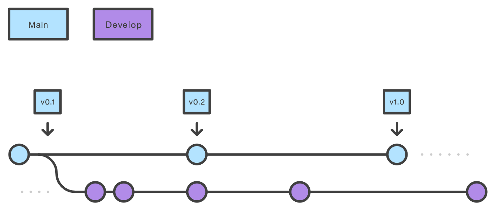
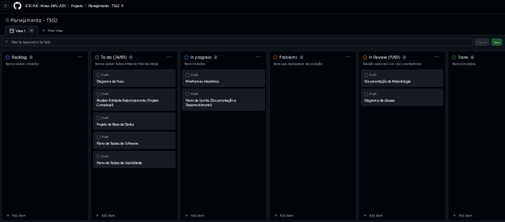

# Metodologia

Nesta seção estão apresentados o Controle de Versão e o Gerenciamento do Projeto em questão. No Controle de Versão, seguimos a metodologia GitFlow, que nos permite controlar as alterações no código e realizar testes antes de serem integradas na branch principal. Já no Gerenciamento do Projeto, utilizamos a metodologia Scrum, com sprints semanais e uma equipe de desenvolvimento e design responsáveis pela implementação e entrega das funcionalidades. Utilizamos também o GitHub Project para organizar as tarefas da equipe, com o objetivo de garantir uma gestão eficiente e organizada para o desenvolvimento do projeto.

## Controle de Versão

A ferramenta de controle de versão adotada no projeto foi o
[Git](https://git-scm.com/), sendo que o [Github](https://github.com)
foi utilizado para hospedagem do repositório.

O projeto segue a seguinte convenção para o nome de branches:

- `main`: versão estável já testada do software
- `dev`: versão de desenvolvimento do software

  Figura 01 - Controle de Versão 

Quanto à gerência de issues, o projeto adota a seguinte convenção para
etiquetas:

- `documentation`: melhorias ou acréscimos à documentação
- `bug`: uma funcionalidade encontra-se com problemas
- `development`: desenvolvimento de uma funcionalidade

A introdução de novas funcionalidades, desenvolvimento, testes e correções de bugs serão realizados na branch Develop e somente quando houver uma nova versão do projeto é que será feito o merge com a branch Master. Dessa forma, somente quando as alterações forem testadas e aprovadas na branch Develop é que será permitido transferir para a branch Master.

## Gerenciamento de Projeto

### Divisão de Papéis

Os membros do grupo foram divididos entre os seguintes papéis:
- `Scrum Master` - Wesley Correa Gomes
- `Product Owner` - Marcos Teixeira Dias
- `Dev Team` - Wesley, Bruno, Pedro, Marcos, Gustavo, Renan
- `Design Team` - Wesley Correa Gomes

### Processo

A distribuição de tarefas da equipe está sendo organizada no GitHub Project, que se encontra estruturado nos seguintes tópicos:

- `Backlog`: todas as atividades que devem ser realizadas no projeto, desde a documentação até o desenvolvimento final do site.
- `Sprint Backlog`: todas as atividades que devem ser realizadas no projeto até o prazo final da etapa.
- `To do (atualizado a cada vencimento de prazo)`: Apresenta o prazo das atividades dessa semana.
- `In progress`: O que está sendo feito.
- `Problems`: Correção de bugs e problemas.
- `In Review (atualizado semanalmente)`: O que precisa ser revisado junto ao orientador.
- `Done`: Tudo o que foi finalizado.

  Figura 02 - Kanban GitHub 

### Ferramentas

As ferramentas empregadas no projeto são:

- `Editor de código`: Visual Code Studio
- `Ferramentas de comunicação`: WhatsApp, Discord e Microsoft Teams
- `Ferramentas de desenho de tela (interface, _wireframing_)`: Canvas, Figma
- `Ferramentas de desenho de Digrama`: MySQL WorkBench, LucidChart

O editor de código foi escolhido porque ele possui uma integração com o
sistema de versão. As ferramentas de comunicação utilizadas possuem
integração semelhante e por isso foram selecionadas. Por fim, para criar
diagramas utilizamos essa ferramenta por melhor captar as
necessidades da nossa solução.
