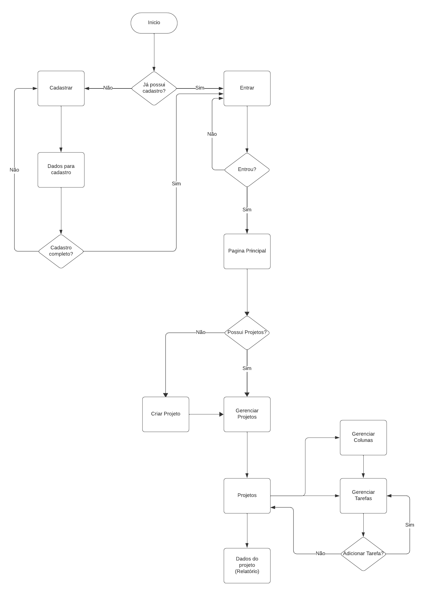
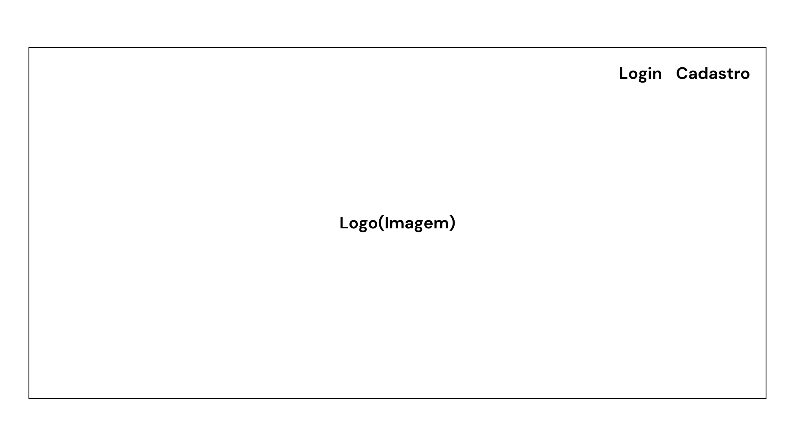
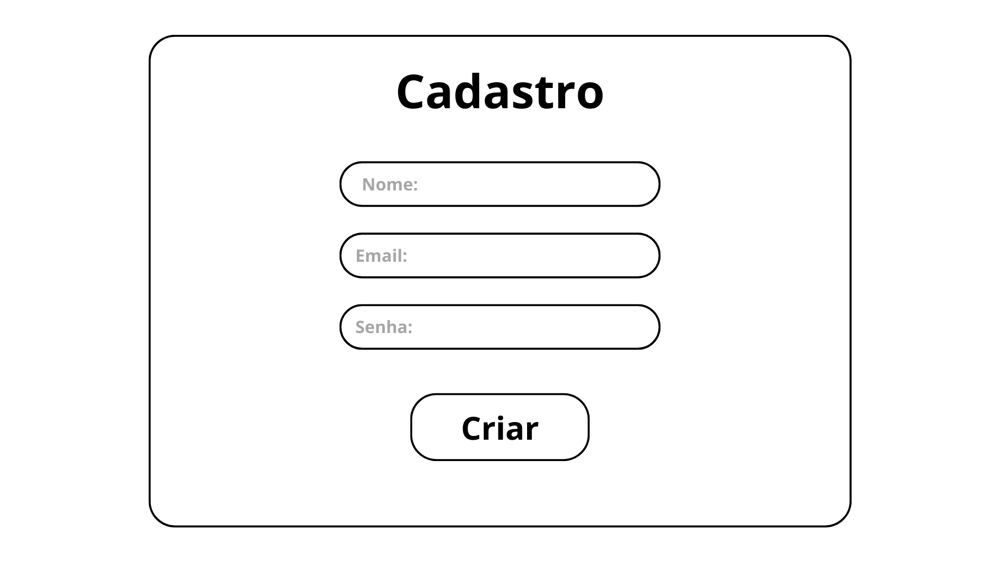
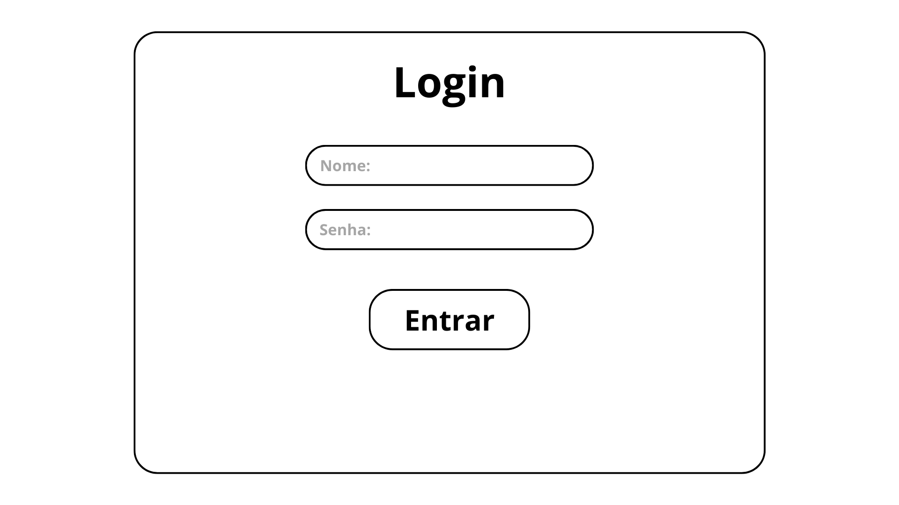
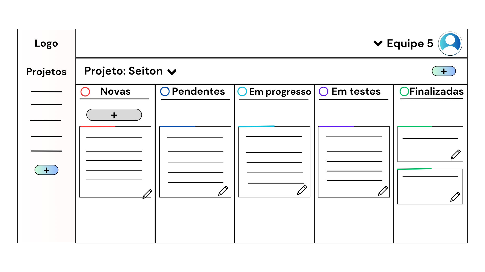
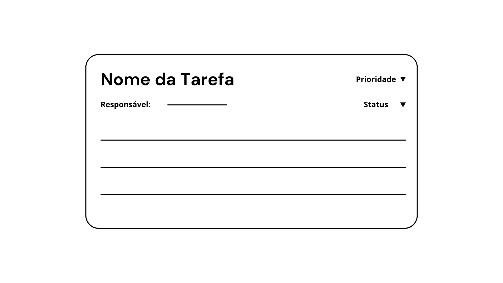
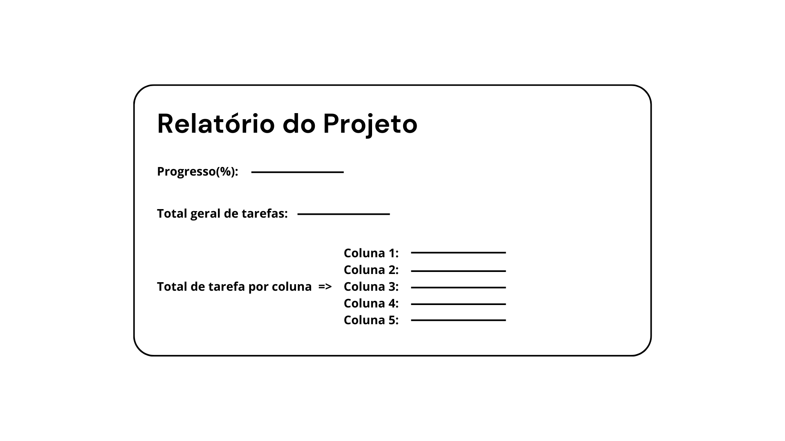

# Projeto de Interface

Visão geral da interação do usuário pelas telas do sistema e protótipo interativo das telas com as funcionalidades que fazem parte do sistema (wireframes).

## Diagrama de Fluxo

O diagrama apresenta o estudo do fluxo de interação do usuário com o sistema. Isso permite que o design das interações e fluxos de tela sejam bem planejados e gerem impacto na qualidade do design do wireframe interativo desenvolvido.

Abaixo o diagrama de fluxo com o caminho a ser percorrido pelo usuário final do site.
  
  Figura 01 - Diagrama de Fluxo 

## Wireframes

## Tela Inicial

Página apresentada assim que se acessa o site. Onde é possivel o usuário realizar o cadastro e/ou login para começar a utilizar a aplicação do site.
  
  Figura 02 - Tela Inicial 

## Tela de Cadastro (RF-01)

Permite a criação de uma nova conta por parte do membro designado como "Master" dentro do grupo, sendo necessário fornecer os dados de registro, incluindo nome de usuário, endereço de e-mail e senha.
  
  Figura 03 - Tela de Cadastro 

## Tela de Login (RF-02)

Possibilita que o usuário efetue o processo de autenticação, concedendo-lhe acesso ao conjunto de projetos mediante a inserção das informações de identificação, ou seja, nome de usuário e senha do grupo.
  
  Figura 04 - Tela de Login 

## Tela Principal (RF-03, RF-04, RF-05)

Após o usuário criar ou ingressar em um grupo, a primeira tela a ser exibida será a tela principal, caso o usuário já tenha criado projetos serão apresentadas colunas de acordo com as necessidades específicas do projeto. Nestas colunas, serão registradas as informações relativas às tarefas, proporcionando a capacidade de edição a qualquer momento pelo responsável pela atividade. Isso incluirá a definição do nível de prioridade e do status do desenvolvimento.

O menu lateral fornecerá um acesso rápido aos projetos em andamento. Ao selecionar um projeto específico, as colunas pertinentes a esse projeto serão exibidas, ajustando-se automaticamente ao contexto do projeto escolhido.
  
  Figura 05 - Tela Principal 

## Editar Tarefas (RF-06, RF-07)

Ao acionar a opção "Editar Tarefa", um modal será exibido, permitindo que o usuário responsável faça a edição das informações de acordo com as necessidades e o status atual do desenvolvimento da tarefa em questão.
  
  Figura 06 - Editar Tarefas 

## Relatório do Progresso (RF-08)

Ao acionar a opção "Relatório" no projeto, um modal será exibido, permitindo que o usuário visualize o andamento do projeto por meio de informações como a porcentagem de progresso, total geral de tarefas, total de tarefas em cada coluna.
  
  Figura 07 - Relatório de Progresso 
