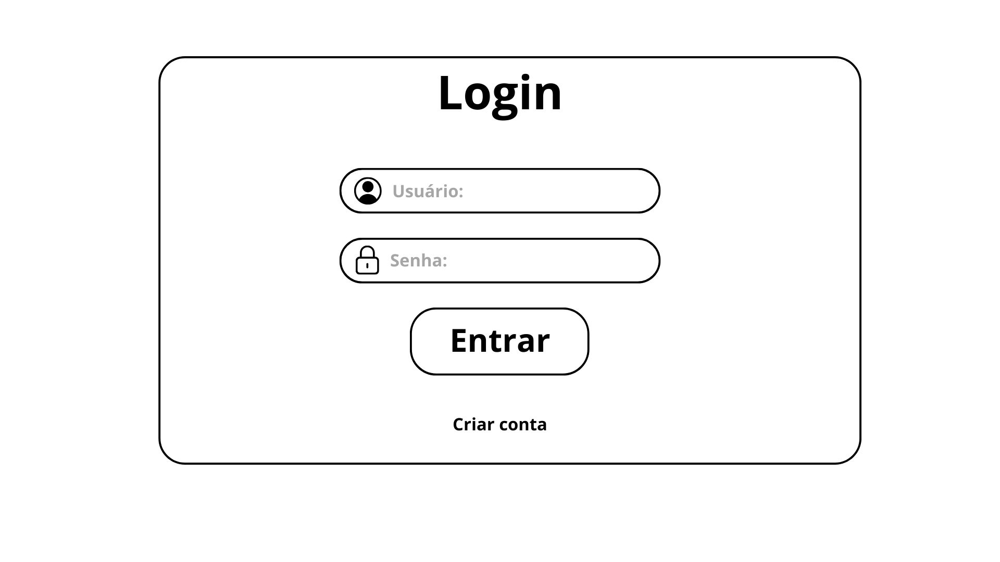
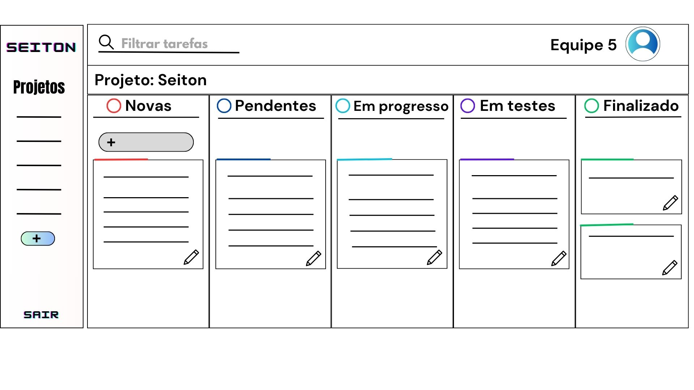
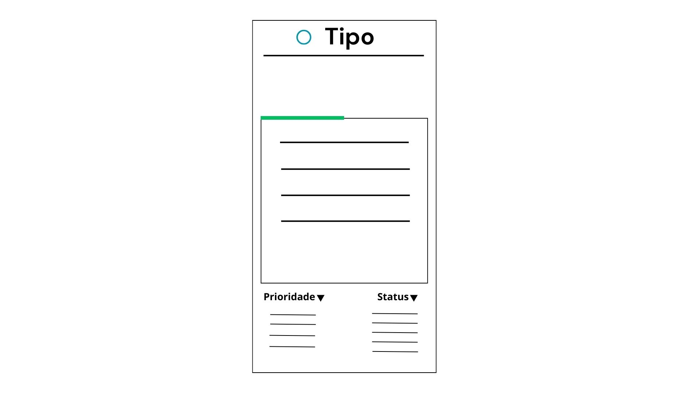

# Projeto de Interface

Visão geral da interação do usuário pelas telas do sistema e protótipo interativo das telas com as funcionalidades que fazem parte do sistema (wireframes).

## Diagrama de Fluxo

O diagrama apresenta o estudo do fluxo de interação do usuário com o sistema interativo e  muitas vezes sem a necessidade do desenho do design das telas da interface. Isso permite que o design das interações seja bem planejado e gere impacto na qualidade no design do wireframe interativo que será desenvolvido logo em seguida.

## Wireframes

## Tela de login

Possibilita que o usuário efetue o processo de autenticação, concedendo-lhe acesso ao conjunto de projetos mediante a inserção das informações de identificação, ou seja, nome de usuário e senha do grupo.
  

## Criar conta

Permite a criação de uma nova conta por parte do membro designado como "Master" dentro do grupo, sendo necessário fornecer os dados de registro, incluindo endereço de e-mail, nome de usuário e senha.
  

## Tela principal

Após o usuário criar ou ingressar em um grupo, a primeira tela a ser exibida será a tela principal, na qual serão apresentadas colunas de acordo com as necessidades específicas do projeto. Nestas colunas, serão registradas as informações relativas às tarefas, proporcionando a capacidade de edição a qualquer momento pelo responsável pela atividade. Isso incluirá a definição do nível de prioridade e do status do desenvolvimento.

O menu lateral fornecerá um acesso rápido aos projetos em andamento. Ao selecionar um projeto específico, as colunas pertinentes a esse projeto serão exibidas, ajustando-se automaticamente ao contexto do projeto escolhido.
  

## Editar tarefas

Ao acionar a opção "Editar Tarefa", um modal será exibido, permitindo que o usuário responsável faça a edição das informações de acordo com as necessidades e o status atual do desenvolvimento da tarefa em questão.
  

<!-- São protótipos usados em design de interface para sugerir a estrutura de um site web e seu relacionamentos entre suas páginas. Um wireframe web é uma ilustração semelhante do layout de elementos fundamentais na interface.
 
> **Links Úteis**:
> - [Protótipos vs Wireframes](https://www.nngroup.com/videos/prototypes-vs-wireframes-ux-projects/)
> - [Ferramentas de Wireframes](https://rockcontent.com/blog/wireframes/)
> - [MarvelApp](https://marvelapp.com/developers/documentation/tutorials/)
> - [Figma](https://www.figma.com/)
> - [Adobe XD](https://www.adobe.com/br/products/xd.html#scroll)
> - [Axure](https://www.axure.com/edu) (Licença Educacional)
> - [InvisionApp](https://www.invisionapp.com/) (Licença Educacional) -->
