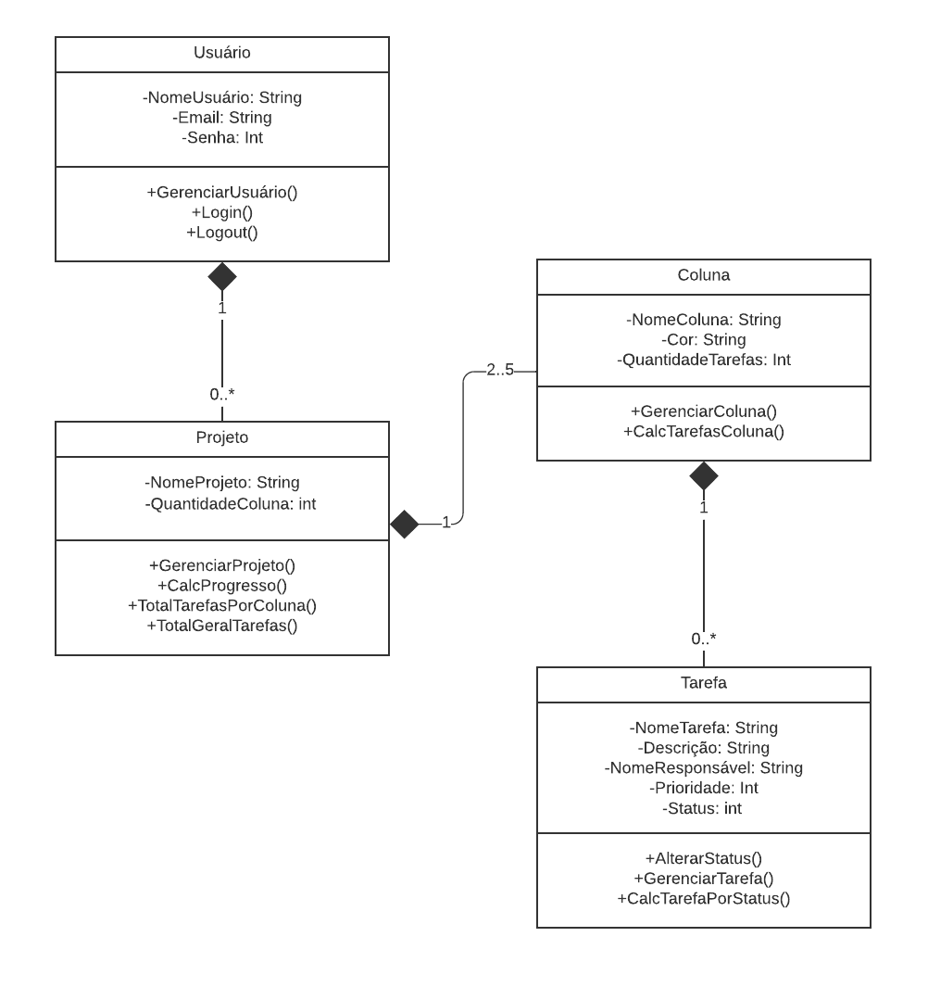

# Arquitetura da Solução

Definição de como o software é estruturado em termos dos componentes que fazem parte da solução e do ambiente de hospedagem da aplicação.

## Diagrama de Classes

O diagrama de classes ilustra graficamente como será a estrutura do software, e como cada uma das classes da sua estrutura estarão interligadas. Essas classes servem de modelo para materializar os objetos que executarão na memória.

  Figura 01 - Diagrama de Classes 

## Modelo ER (Projeto Conceitual)

O Modelo ER representa através de um diagrama como as entidades (coisas, objetos) se relacionam entre si na aplicação interativa.

  Figura 02 - Modelo ER (Projeto Conceitual) 

## Projeto da Base de Dados

O projeto da base de dados corresponde à representação das entidades e relacionamentos identificadas no Modelo ER, no formato de tabelas, com colunas e chaves primárias/estrangeiras necessárias para representar corretamente as restrições de integridade.
 
  Figura 03 - Projeto da Base de Dados 

## Tecnologias Utilizadas

### Ferramentas

As ferramentas empregadas no projeto são:

- `Editor de código`: Visual Code Studio
- `Ferramentas de comunicação`: WhatsApp, Discord e Microsoft Teams
- `Ferramentas de desenho de tela (interface, _wireframing_)`: Canva, Figma
- `Ferramentas de desenho de Digrama`: MySQL WorkBench, LucidChart

Para o desenvolvimento da aplicação será utilizado um conjunto de tecnologias web, incluindo HTML, CSS, JavaScript, C#, ASP.NET e MySQL. A escolha dessas tecnologias é fundamentada na capacidade de oferecer uma experiência robusta e interativa aos usuários, bem como na eficiência na manipulação de dados.

A aplicação também seguirá o padrão arquitetural Model-View-Controller (MVC) para uma organização estruturada e modular do código-fonte. Este padrão facilita a manutenção, extensibilidade e testabilidade da aplicação, garantindo um desenvolvimento ágil e eficaz.

<!-- Descreva aqui qual(is) tecnologias você vai usar para resolver o seu problema, ou seja, implementar a sua solução. Liste todas as tecnologias envolvidas, linguagens a serem utilizadas, serviços web, frameworks, bibliotecas, IDEs de desenvolvimento, e ferramentas. -->

<!-- Apresente também uma figura explicando como as tecnologias estão relacionadas ou como uma interação do usuário com o sistema vai ser conduzida, por onde ela passa até retornar uma resposta ao usuário. -->

  Figura 04 - Interação do usuário com o sistema 

## Hospedagem
<!-- Explique como a hospedagem e o lançamento da plataforma foi feita. -->

Para o desenvolvimento da aplicação será utilizado um sistema de gerenciamento de banco de dados relacional como componente central de sua arquitetura. O uso de um banco de dados relacional é essencial para a integridade, eficiência e escalabilidade dos dados da aplicação, garantindo um armazenamento e recuperação eficazes das informações.

<!-- > **Links Úteis**:
>
> - [Website com GitHub Pages](https://pages.github.com/)
> - [Programação colaborativa com Repl.it](https://repl.it/)
> - [Getting Started with Heroku](https://devcenter.heroku.com/start)
> - [Publicando Seu Site No Heroku](http://pythonclub.com.br/publicando-seu-hello-world-no-heroku.html) -->
