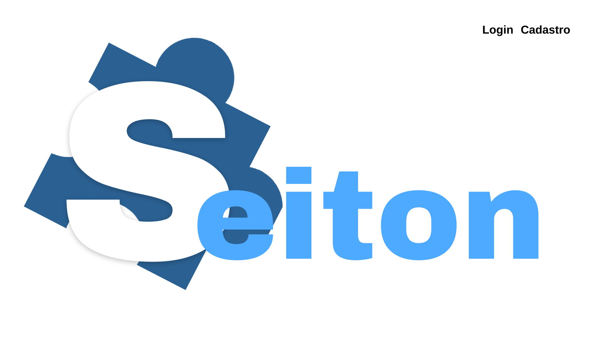
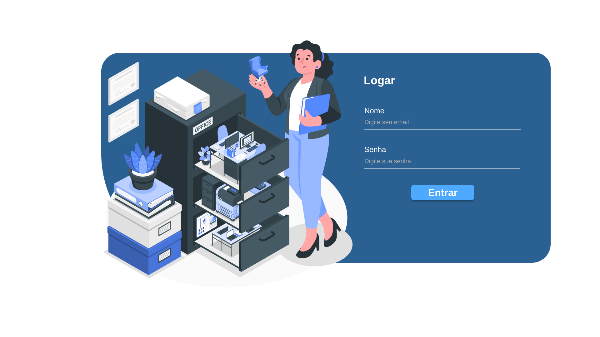

# Template Padrão da Aplicação

Neste documento está apresentado o layout padrão da aplicação que será utilizado em todas as páginas, incluindo com a definição de identidade visual e iconografia.
  

## Paleta de Cores

Esta paleta de cores foi escolhida pois transmite uma aura de sofisticação e modernidade. Além de destacar os elementos que compõem a aplicação.
  
  Figura 01 - Paleta de Cores 

## Tipografia

- Fonte principal -> Arimo
- Fonte da Logo -> Archivo Black

Esta fonte principal foi escolhida para garantir uma boa legibilidade e harmonia com os elementos da aplicação. Já a fonte da logo se mostrou mais adequada por proporcionar um estilo distinto e moderno que destaca a marca.

## Iconografia

Os ícones escolhidos para serem utilizados no site foram retirados do Gooogle Fonts, pois se mostraram bem intuitivos, além de possuirem uma aparência moderna.

Estes ícones se encontram em: [Google Fonts/Icons](https://fonts.google.com/icons)

## Telas
A seguir estão apresentadas as telas referentes ao projeto:

### Tela Inicial
  Figura 01 - Tela Inicial 

### Tela de Cadastro
  Figura 02 - Tela de Cadastro 

### Tela de Login
  Figura 03 - Tela de Login 

### Tela Principal
  Figura 04 - Tela Principal 

### Editar Tarefas
  Figura 05 - Editar Tarefas 

### Relatório de Progresso
  Figura 06 - Relatório de Progresso 
